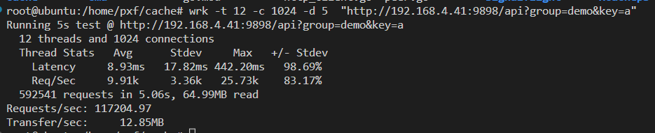
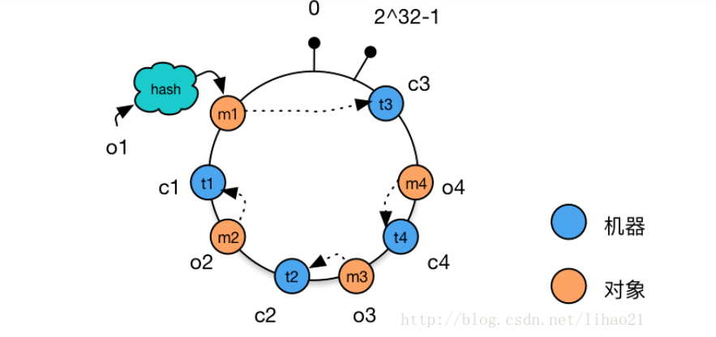

# xcache
a distributed cache

## 介绍
1.高性能分布式缓存

2.内存淘汰算法：LRU、LFU、FIFO

3.一致性哈希

## 安装教程
1.cd cmd

2.可修改main函数registryAddr地址

3.go build main.go

## 使用说明
1.启动网关：./main -api

2.启动缓存服务：./main -port 8081

3.访问：http://192.168.4.41:9898/api?group=demo&key=a
