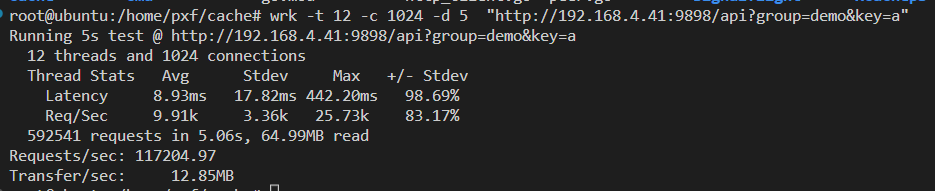
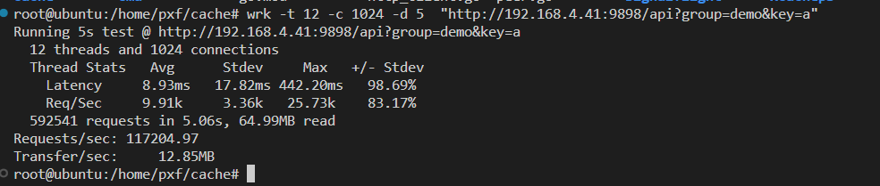

# xcache

#### 介绍
1.高性能分布式缓存

2.内存淘汰算法：LRU、LFU、FIFO

3.防缓存击穿中间件signalflight

4.一致性哈希

5、服务注册
#### 软件架构
软件架构说明

#### 安装教程
1.cd cmd
2.可修改main函数registryAddr地址
3.go build main.go

#### 使用说明
1.启动网关：./main -api
2.启动缓存服务：./main -port 8081
3.访问：http://192.168.4.41:9898/api?group=demo&key=a

#### 参与贡献

1.  Fork 本仓库
2.  新建 Feat_xxx 分支
3.  提交代码
4.  新建 Pull Request

#### 特技

1.  使用 Readme\_XXX.md 来支持不同的语言，例如 Readme\_en.md, Readme\_zh.md
2.  Gitee 官方博客 [blog.gitee.com](https://blog.gitee.com)
3.  你可以 [https://gitee.com/explore](https://gitee.com/explore) 这个地址来了解 Gitee 上的优秀开源项目
4.  [GVP](https://gitee.com/gvp) 全称是 Gitee 最有价值开源项目，是综合评定出的优秀开源项目
5.  Gitee 官方提供的使用手册 [https://gitee.com/help](https://gitee.com/help)
6.  Gitee 封面人物是一档用来展示 Gitee 会员风采的栏目 [https://gitee.com/gitee-stars/](https://gitee.com/gitee-stars/)
